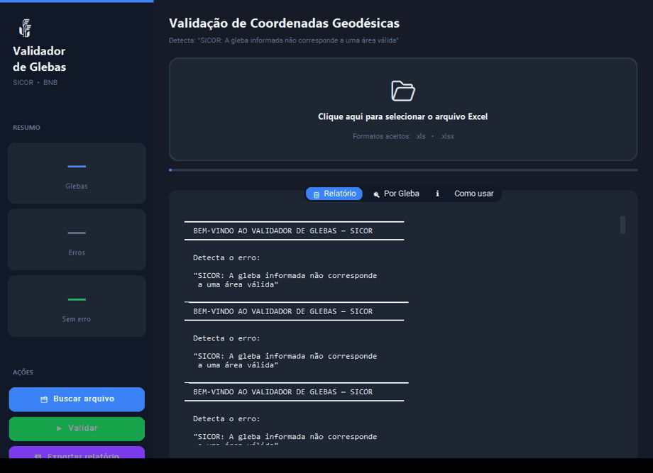
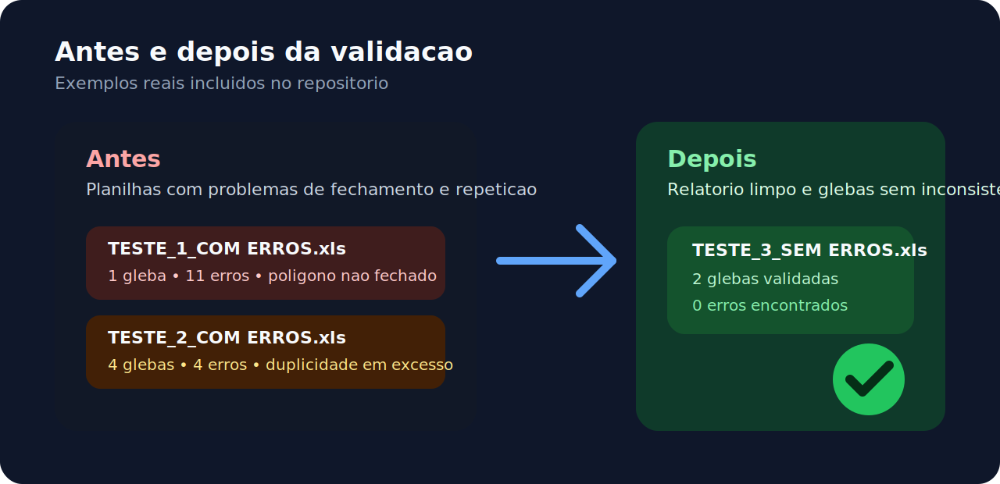

<p align="center">
  
</p>

# Validador de Glebas

Aplicativo desktop em Python com `CustomTkinter` para validar planilhas de coordenadas geodesicas e identificar inconsistencias por gleba de forma rapida.

## O que o projeto faz

- Le arquivos `.xls` e `.xlsx`
- Detecta automaticamente colunas de gleba, ponto, latitude e longitude
- Valida fechamento de poligono e repeticao indevida de coordenadas
- Sinaliza coordenadas invalidas
- Mostra resumo por gleba e permite exportar relatorio
- Gera executavel `.exe` para distribuicao no Windows

## Escopo atual no SICOR

Atualmente, este projeto foi preparado para validar apenas estes 2 erros do SICOR:

- `SICOR: A gleba informada nao corresponde a uma area valida.`
- `SICOR: Gleba deve ser polígono fechado: o primeiro e o último ponto devem ser iguais.`

## Tipos de erro identificados

- `COORDENADA INVALIDA`: latitude ou longitude nao numerica
- `PONTO DUPLICADO EM EXCESSO`: coordenada repetida 3 ou mais vezes na sequencia
- erros de fechamento e sequenciamento do contorno da gleba

## Fluxo de uso

<p align="center">
  
</p>

## Demo rapida

<p align="center">
  
</p>

O GIF acima foi gerado com a propria aplicacao usando a planilha `TESTE_2_COM ERROS.xls`, mostrando a abertura da interface, a selecao do arquivo e a exibicao do relatorio final.

## Antes e depois

<p align="center">
  
</p>

Usando os arquivos de exemplo incluidos no repositorio:

- `TESTE_1_COM ERROS.xls`: 1 gleba e 11 erros encontrados
- `TESTE_2_COM ERROS.xls`: 4 glebas e 4 erros encontrados
- `TESTE_3_SEM ERROS.xls`: 2 glebas e 0 erros encontrados

Isso ajuda a mostrar rapidamente, na propria pagina do GitHub, o contraste entre uma planilha com problemas e uma planilha validada com sucesso.

## Como executar o app

```powershell
.\.venv\Scripts\python.exe .\validador_glebas_app.py
```

## Como gerar o executavel

```powershell
.\build_executavel.bat
```

O executavel sera gerado em `dist\ValidadorGlebas.exe`.

## Estrutura principal

- `validador_glebas_app.py`: interface desktop principal
- `validador2_glebas.py`: versao auxiliar da logica de validacao
- `build_executavel.bat`: script de build com PyInstaller
- `version_info.txt`: metadados do executavel no Windows
- `assets/validador_glebas_icon.ico`: icone do aplicativo

## Arquivos de exemplo

O repositorio inclui planilhas de exemplo para testes rapidos:

- `TESTE_1_COM ERROS.xls`
- `TESTE_2_COM ERROS.xls`
- `TESTE_3_SEM ERROS.xls`

## Distribuicao

Existe um pacote pronto para distribuicao local em `pacote_distribuicao`, com executavel, exemplos e instrucoes.

## Tecnologias usadas

- Python 3.10
- CustomTkinter
- pandas
- openpyxl
- xlrd
- PyInstaller

## Autor

Projeto publicado por [Rodrigo-dev7](https://github.com/Rodrigo-dev7).
